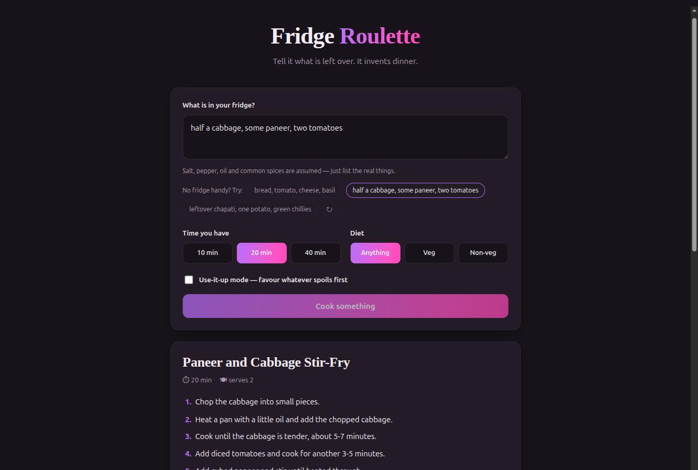

# 🍳 Fridge Roulette

**Tell it what is left over. It invents dinner.**

Live: **https://fridge.balakrishnan.me**

You type what is actually sitting in your fridge — *"half a cabbage, some paneer, two tomatoes"* —
and get back a dish you can cook right now: a named recipe, four to six steps, a time and serving
count, an honest list of anything you are missing, and substitutions for what you do not have.

Built for the [AWS Builder Center Weekend Creative Challenge](https://builder.aws.com/content/3HkKlGRPcyks0rQpYVUVY9veCX0/weekend-challenge-build-a-creative-app).



---

## The problem it solves

The 7pm problem. You open the fridge, see a random set of leftovers, and lose ten minutes
deciding what to do with them. Recipe sites work the other way round — they tell you what to buy.
This one starts from what you already have.

## What makes it a *creative* app

It does not look anything up. There is no recipe database. Every dish is invented on the spot by
a language model, given the constraints you set, and it names the dish itself. Ask twice and you
get two different answers.

## Architecture

```
Browser  ──HTTPS──>  CloudFront  ──>  S3 (static site)
   │
   └──POST /──>  API Gateway (HTTP API)  ──>  Lambda (Python 3.13)  ──>  Amazon Bedrock
                                                                          Nova Lite
```

| Service | Role |
|---|---|
| **Amazon Bedrock** | Nova Lite invents the dish and returns it as structured JSON |
| **AWS Lambda** | Builds the prompt, calls Bedrock, parses and validates the response |
| **Amazon API Gateway** | HTTP API with CORS, plus request throttling |
| **Amazon S3** | Hosts the static frontend |
| **Amazon CloudFront** | HTTPS and the custom domain |

### Why Nova Lite

The task is short, structured, and high-volume-friendly: roughly 200 tokens in, 170 out. Nova Lite
is the cheapest model that reliably holds a JSON shape at that size — about **$0.05 per 1,000
recipes**. Nova Pro is around 13× the price for no meaningful gain on a task this small.

### The inference profile detail

In `ap-south-1` every Nova model is `INFERENCE_PROFILE` only, so the bare model id is rejected.
You must call the regional cross-region profile:

```
apac.amazon.nova-lite-v1:0
```

The IAM policy needs permission on **both** the profile and the underlying foundation model,
because cross-region inference may execute the call in another region:

```json
{
  "Effect": "Allow",
  "Action": "bedrock:InvokeModel",
  "Resource": [
    "arn:aws:bedrock:ap-south-1:<account-id>:inference-profile/apac.amazon.nova-lite-v1:0",
    "arn:aws:bedrock:*::foundation-model/amazon.nova-lite-v1:0"
  ]
}
```

## Keeping the model in line

A language model asked for JSON will occasionally wrap it in prose or a code fence. Two defences
in `lambda_function.py`:

1. **`_extract_json`** takes everything between the first `{` and the last `}`, so stray
   commentary or fences do not break parsing.
2. **`_clean`** coerces every field to the type the UI expects — lists stay lists, numbers fall
   back to defaults, a missing name becomes *"Fridge Surprise"*. The only genuinely fatal case is
   a recipe with no steps.

The prompt itself carries one worked example of the exact shape, which is what keeps the model
consistent in the first place.

## Files

| File | What it is |
|---|---|
| `lambda_function.py` | The whole backend — prompt, Bedrock call, parsing, validation |
| `index.html` | The whole frontend — no build step, no framework, no dependencies |

## Running it yourself

1. Create a Lambda (Python 3.13), paste `lambda_function.py`, set the handler to
   `lambda_function.lambda_handler`.
2. Timeout **30s** — the 3 second default is not enough for a Bedrock round trip.
3. Attach the IAM policy above.
4. Optionally set `TABLE_NAME` to a DynamoDB table with partition key `id` to save recipes.
   Leave it unset and saving is skipped entirely.
5. Put an HTTP API in front with CORS allowing `POST` and `content-type`.
6. Set `API` at the top of the `<script>` block in `index.html` to your endpoint, and upload to S3.

### Request

```json
{ "ingredients": "2 eggs, half an onion, leftover rice", "time_budget": 20, "diet": "veg", "use_it_up": true }
```

`time_budget` is one of `10 | 20 | 40`, `diet` is one of `any | veg | nonveg`. Anything else falls
back to a default rather than reaching the model.

### Response

```json
{
  "name": "Curry Leaf Egg Rice",
  "time_mins": 20,
  "serves": 2,
  "steps": ["…"],
  "missing": [],
  "substitutions": ["…"],
  "note": "…",
  "id": "4962d221"
}
```

## Limits

| Layer | Limit |
|---|---|
| Bedrock Nova Lite | 40 requests/minute — the real ceiling |
| API Gateway | 5 req/sec, burst 10 |
| Lambda | 10 concurrent executions (account default) |

Bedrock throttling surfaces as a friendly *"The kitchen is busy"* message rather than an error page.
